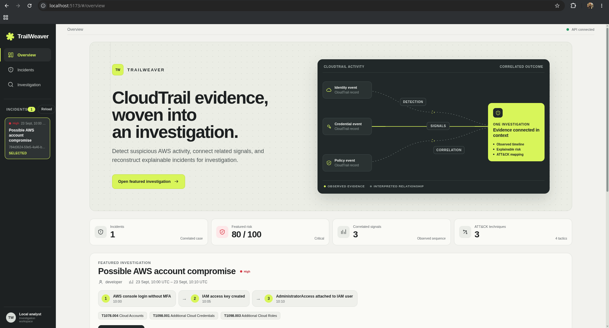
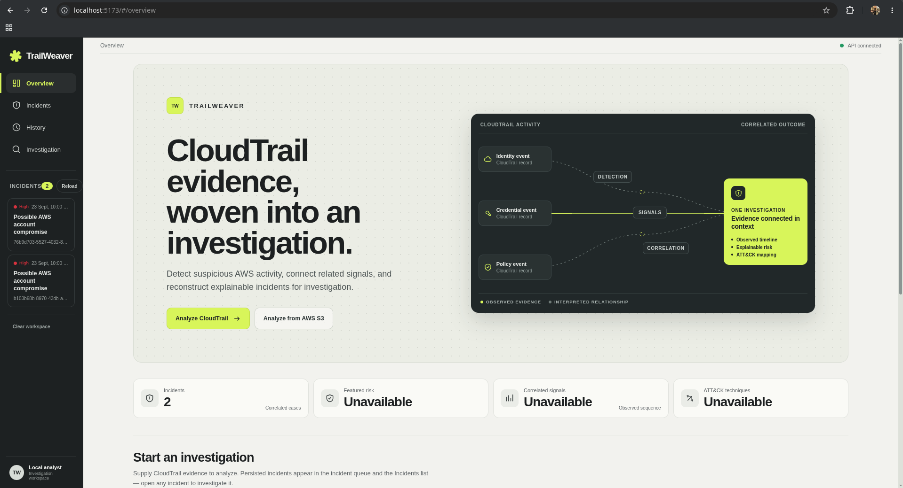
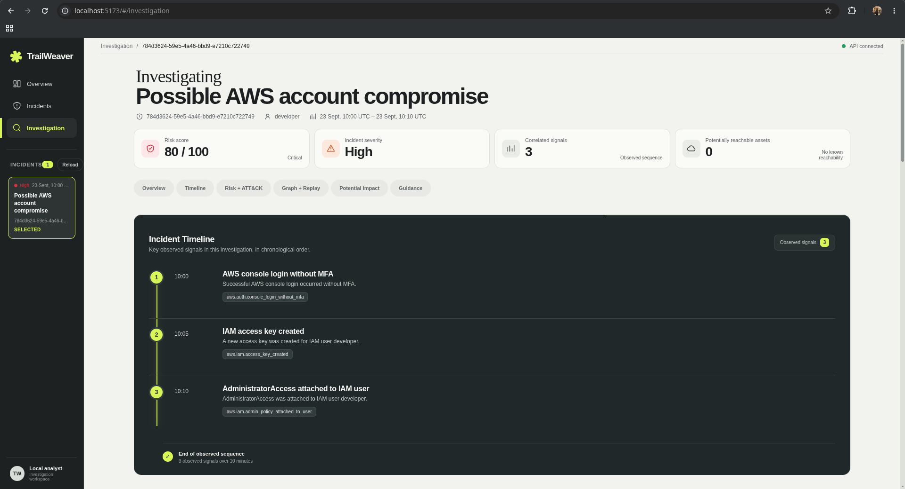
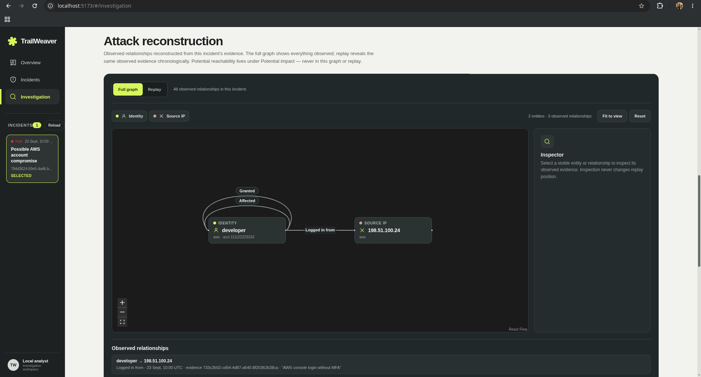
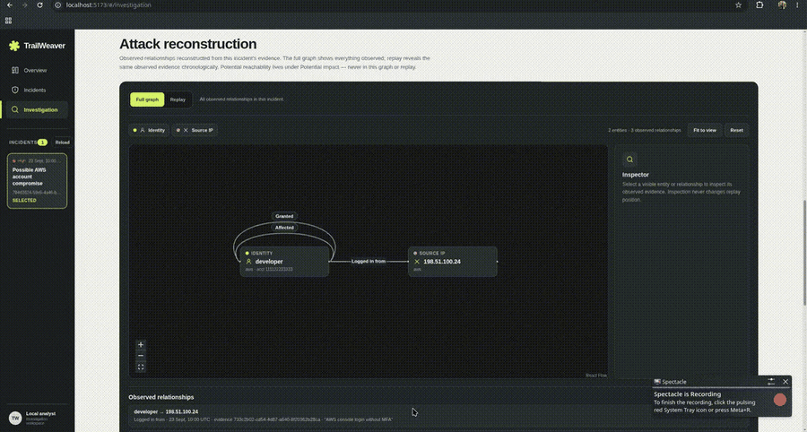

# TrailWeaver

Deterministic AWS CloudTrail detection and incident-reconstruction platform.

`CloudTrail → Detection → Correlation → Investigation`



*Python · FastAPI · React + TypeScript · SQLite · Docker · Terraform · AWS*

- Normalizes CloudTrail exports into a clean, provider-neutral event model.
- Applies deterministic, explainable detections and correlates related signals into incidents.
- Reconstructs timelines, risk explanations, MITRE ATT&CK mappings, and observed attack graphs.
- Replays evidence chronologically and estimates blast radius over explicitly loaded cloud context.
- Ships a CLI, API, dashboard, containers, CI, and an AWS deployment configuration.

## Demo

[](docs/demo.md)

> The recording script in `docs/demo.md` doubles as a guided local walkthrough, and
> [Run it yourself](#run-it-yourself) reproduces every step on your machine.

Planned demo chapters (about 2–3 minutes total):

| Time | Chapter |
| ---- | ------- |
| 0:00 | CloudTrail evidence |
| 0:20 | CLI analysis |
| 0:40 | Incident creation |
| 0:55 | Dashboard overview |
| 1:10 | Timeline, risk, and MITRE ATT&CK |
| 1:30 | Attack graph |
| 1:45 | Temporal replay |
| 2:00 | Blast radius |
| 2:10 | Investigation guidance |
| 2:25 | Docker, CI, Terraform, and AWS architecture |

Full script, setup, and capture checklist: [`docs/demo.md`](docs/demo.md).

## The problem

CloudTrail provides detailed records of AWS API activity, but an investigation often
requires analysts to interpret a large volume of low-level events, connect actions
performed across identities and resources, and reconstruct what happened in the right
order. Individual suspicious events may be easy to miss, while the security impact of a
sequence of otherwise ordinary actions can be difficult to assess.

TrailWeaver aims to close that gap by normalizing cloud activity, detecting suspicious
behavior, correlating related evidence, and presenting an explainable account of an
incident and its potential impact.

## How it works

```text
CloudTrail export -> ingestion -> normalized events -> AWS detections
                  -> AWS correlations -> incident creation -> incident repository
                  -> read API and dashboard
```

The system is organized into four product layers:

1. **Data:** ingest CloudTrail activity and translate AWS-specific records into a clean
   internal event model.
2. **Security intelligence:** apply deterministic detections, generate signals, correlate
   related behavior, and form incidents.
3. **Investigation:** reconstruct timelines, calculate explainable risk, map behavior to
   MITRE ATT&CK, build identity-resource attack graphs, and estimate blast radius.
4. **User experience:** expose investigation data through an API and dashboard, including
   attack replay and investigation guidance.

Tests, delivery automation, infrastructure, deployment, and monitoring support those
layers as the project matures. Each milestone adds the simplest readable design that
meets the current need. Security conclusions are deterministic, testable, and
explainable. AWS-specific parsing stays separate from the normalized domain model, and
dependencies or infrastructure are added only when a milestone requires them.

## Investigation walkthrough

### Timeline and incidents

Every investigation starts from evidence in order. TrailWeaver keeps accepted CloudTrail
events in source order, analyzes them in timestamp order (retaining original position
for equal timestamps), and presents the incident as a deterministic timeline. Signals
carry stable identities, so the timeline, graph, and replay join on explicit
`signal_id` references rather than inferred timestamp matches.

### Risk and MITRE ATT&CK

Risk factors are deterministic explanations of why an incident matters, and MITRE
ATT&CK mappings describe observed behavior only — they are not proof of intent. Both
are derived views of stored incident evidence, alongside the observed attack graph and
investigation guidance.



### Attack graph

The Graph view renders the `GET /api/v1/incidents/{incident_id}/graph` response
directly — no graph is rebuilt in the browser — with pan, zoom, fit-to-view, reset,
type-distinguished nodes, readable relationship labels, and a node/edge inspector.
Analysts move between Overview and Graph without losing incident selection, and the
deterministic initial layout places the same graph identically on every load.



Graph semantics are observed relationships only: who performed the activity, where it
originated, which identities, roles, and resources appear in the incident evidence,
how those entities connect, which signal produced each relationship, and when each
relationship was observed. Selecting a node shows only data returned by the backend
(type, label, provider, and available account/region/ARN context). Selecting an edge
shows its canonical relationship, observed timestamp, and signal reference.

The attack graph must not be confused with blast radius. The graph contains entities
and relationships observed in the incident; blast radius estimates potentially
reachable known assets from explicit permission grants in the loaded cloud context.
Reachable assets are never added to the graph, and no edge implies access beyond what
the evidence supports.

### Temporal replay

Replay mode reconstructs the observed incident sequence from the existing incident
timeline and graph responses. Each timeline observation is linked by `signal_id` to
zero, one, or multiple graph relationships. This keeps same-timestamp signals
distinguishable and lets missing linkage degrade honestly without guessing.



Replay steps are ordered deterministically by timestamp, then stable signal identity.
Analysts can move directly between evidence markers, use Previous and Next, run or
pause restrained automatic playback, and restart at the first observation. The graph
is cumulative: earlier observed relationships remain visible as later evidence is
reached, while relationships introduced by the current step receive restrained
emphasis. Node positions and self-loop geometry are computed from the full observed
graph and remain stable throughout playback.

Full Graph and Replay preserve separate responsibilities:

- Full Graph shows every observed relationship returned for the incident.
- Replay reveals evidence-linked observed relationships chronologically.
- Potential impact remains blast-radius context over known assets and is never animated
  into the observed graph.

Replay reconstructs existing observed evidence. It does not predict attacker behavior,
invent intermediary activity, claim that potentially reachable assets were accessed,
or use AI-generated inference. Its state is deterministic presentation logic over data
that is already loaded; stepping does not make additional API requests.

### Blast radius

The blast-radius foundation keeps provider-neutral representations and analysis
deliberately separate:

- `AttackGraph` represents relationships observed in suspicious incident activity.
- `CloudContext` represents assets and permission facts known to exist in the cloud
  environment.
- `BlastRadiusAnalyzer` combines an incident's primary identity with explicit grants in
  `CloudContext` to estimate which known assets are potentially reachable.

Cloud assets and their identifiers are deterministic, permission effects are limited to
`allow` and `deny`, and context collections are immutable and canonically ordered.
Blast-radius results preserve the effective allow grants that explain each estimate.
They do not depend on or merge with `AttackGraph`.

Blast radius means potential reachability over the assets loaded in TrailWeaver's known
`CloudContext`. It is not a complete AWS IAM authorization answer. Evaluation uses only
explicit `PermissionGrant` objects: resources match exact asset IDs, and a literal `*`
resource means every asset currently loaded in that context—not every resource that may
exist in AWS. Subject selection prefers the primary actor's ARN, then uses a deterministic
provider/account-scoped identity ID for an actor identifier or name. A deny overrides an
allow only when subject, action scope, and resource scope are exactly the same.
TrailWeaver does not parse policy documents, interpret ARN patterns or conditions, or
evaluate IAM precedence beyond this narrow rule.

Cloud context can be constructed directly from in-memory objects or loaded with
`load_cloud_context` from a strict TrailWeaver-owned JSON fixture:

```json
{
  "assets": [
    {
      "asset_type": "role",
      "provider": "aws",
      "account_id": "123456789012",
      "name": "DeploymentRole",
      "arn": "arn:aws:iam::123456789012:role/DeploymentRole",
      "metadata": {"environment": "production"}
    }
  ],
  "permissions": [
    {
      "subject": "arn:aws:iam::123456789012:role/DeploymentRole",
      "actions": ["*"],
      "resources": ["*"],
      "effect": "allow",
      "source": "attached_managed_policy:arn:aws:iam::aws:policy/AdministratorAccess"
    }
  ]
}
```

The fixture is not an AWS IAM policy-document format and loading it performs no AWS or
network calls. Wildcards remain explicit permission facts and never imply that every
real cloud resource is known or reachable.

### Investigation guidance

Investigation guidance is a deterministic derived view of the stored incident evidence.
It tells the analyst what to check next based on what was observed — alongside the
timeline, risk factors, ATT&CK mapping, and blast-radius context in the dashboard. The
dashboard never ships fallback incident or analysis fixtures: titles, actors,
timestamps, signals, risk factors, techniques, guidance, and reachable assets all come
from the configured API.

### Event and parser notes

For CloudTrail events, the parser reports `failure` when `errorCode` is present and
`success` otherwise. Response fields do not independently determine the outcome. Events
constructed without a provider result use `unknown`.

The security attribute map is deliberately narrow. It currently supports `mfa_used`,
`target_user`, `target_role`, `policy_arn`, and `trail_name` for selected actions. Other
request parameters remain available only as raw evidence and are not copied into the
normalized security context.

## Run it yourself

TrailWeaver requires Python 3.11 or newer. Create and activate a virtual environment,
then install the package with its development tools:

```bash
python -m pip install -e ".[dev]"
```

Run the project checks with:

```bash
pytest
ruff check .
```

### Demo dashboard (fastest path)

Run the local development API from the repository root with:

```bash
uvicorn trailweaver.api.app:app --reload
```

This normal entry point intentionally starts with an empty incident repository. For
local dashboard development and presentations, start the explicit demo entry point
instead:

```bash
uvicorn trailweaver.api.demo:app --reload
```

Demo mode starts from an empty workspace through the same opt-in entry point
and runs the real production file-analysis pipeline against an in-memory
repository. Uploading `samples/cloudtrail/account-compromise-sequence.json`
produces the deterministic incident (3 records, 3 accepted, 3 signals,
1 correlation, 1 incident) through the real detection, correlation, incident,
risk, MITRE ATT&CK, blast-radius, and investigation guidance components.
It includes five known demo assets across storage, compute,
database, and secret categories. Reachability is potential reachability over that loaded
demo context; it does not claim any asset was accessed. S3 analysis stays
disabled and a demo-only reset returns the workspace to zero incidents, so the
fixture can be analyzed again. Demo mode is local
development/presentation support only: it adds no persistence or AWS access and is never
enabled by the normal application entry point.

In a second terminal, start the dashboard with the existing frontend dependencies:

```bash
cd frontend
npm run dev
```

The frontend uses `http://localhost:8000` by default. To point it at another API, copy
`frontend/.env.example` to `frontend/.env` and set:

```dotenv
VITE_TRAILWEAVER_API_URL=http://localhost:8000
```

The API allows `http://localhost:5173` by default. Configure additional explicit
frontend origins as a comma-separated list; wildcard origins are rejected:

```bash
TRAILWEAVER_CORS_ORIGINS=https://dashboard.example,https://analyst.example \
  uvicorn trailweaver.api.app:app --reload
```

Build the production frontend bundle with:

```bash
cd frontend
npm run build
```

The API currently provides:

- `GET /health`
- `GET /api/v1/incidents`
- `GET /api/v1/incidents/{incident_id}`
- `GET /api/v1/incidents/{incident_id}/risk`
- `GET /api/v1/incidents/{incident_id}/mitre`
- `GET /api/v1/incidents/{incident_id}/graph`
- `GET /api/v1/incidents/{incident_id}/blast-radius`
- `GET /api/v1/incidents/{incident_id}/guidance`

The default development application starts with an empty in-memory incident source.
Applications embedding TrailWeaver can inject existing `Incident` objects and a known
cloud context through `create_app`.

Sample CloudTrail exports for local analysis live in `samples/cloudtrail/`.

### Runtime CLI and configuration

The `trailweaver` console command is a thin adapter over the ingestion and
investigation application services. It analyzes one local export, analyzes one
explicitly named S3 object, or serves the existing read-only API:

```bash
trailweaver --database ~/.local/share/trailweaver/incidents.sqlite3 \
  analyze-file export.json

trailweaver --database ~/.local/share/trailweaver/incidents.sqlite3 \
  analyze-s3 --bucket example-cloudtrail-bucket \
  --key AWSLogs/111122223333/CloudTrail/us-east-1/export.json.gz \
  --region us-east-1

trailweaver --database ~/.local/share/trailweaver/incidents.sqlite3 \
  serve --host 127.0.0.1 --port 8000
```

Analysis output contains only stage counts: source records, accepted records, failures,
duplicates, analyzed events, signals, correlations, created incidents, and persisted
incidents. Raw CloudTrail payloads are never printed. A successful benign analysis may
report zero signals and incidents. Repeating analysis remains non-idempotent and may
persist another independently identified incident.

Runtime environment variables use the `TRAILWEAVER_` prefix:

- `TRAILWEAVER_DATABASE_PATH`
- `TRAILWEAVER_AWS_REGION`
- `TRAILWEAVER_API_HOST`
- `TRAILWEAVER_API_PORT`
- `TRAILWEAVER_CORS_ORIGINS` as a comma-separated explicit list
- `TRAILWEAVER_LOG_LEVEL`

CLI flags override environment configuration. Without an explicit database path,
TrailWeaver uses the platform-style user data location
`~/.local/share/trailweaver/incidents.sqlite3`; it does not create a database in the
repository. S3 commands use the standard boto3 credential provider chain and expose no
access-key flags. Source failures and runtime/storage failures have distinct nonzero
exit codes. The CLI is synchronous and processes one explicitly requested source per
invocation; it is not a watcher or background job system.

### Persistent investigation repository

TrailWeaver provides an opt-in `SQLiteIncidentRepository` for retaining complete
normalized incident evidence across process restarts. It stores incident and
correlation metadata plus ordered signals and the normalized event fields required to
reconstruct the existing investigation API. Signal IDs, event IDs, enums, and
timezone-aware timestamps are preserved. `raw_event` payloads are intentionally not
copied into this repository; source-record ownership is deferred. SQLite uses the
standard library and an explicit schema version (`PRAGMA user_version`). New databases
initialize at schema v2, and existing v1 incident databases upgrade automatically in one
transaction without changing their incident, correlation, or signal evidence. The new
analysis ledger starts empty after that migration; historical runs are not inferred.
Unknown or unversioned schemas fail without destructive replacement.

Risk, MITRE ATT&CK, the observed attack graph, and investigation guidance remain
deterministic derived views of the stored incident evidence. `CloudContext` is
separate external context and is not stored inside incidents. Blast-radius results
therefore remain unavailable unless an application separately supplies the relevant
cloud context. The repository uses insert-only saves: saving a duplicate incident ID
raises `IncidentAlreadyExistsError` rather than replacing evidence. Incidents are
listed in insertion order.

Persistence is explicitly configured; importing the normal application still creates
no database and it remains empty by default. For an embedding runtime that has
persisted incidents, construct its read API with `create_persistent_app`:

```python
from trailweaver.api.app import create_persistent_app

app = create_persistent_app("/var/lib/trailweaver/incidents.sqlite3")
```

The caller controls the database file path; the repository creates its parent
directory and schema when explicitly constructed. The demo application remains
isolated and in-memory. Persistence adds no CloudTrail ingestion, upload endpoints,
or public incident-write API.

### Real CloudTrail file ingestion

TrailWeaver accepts standard AWS CloudTrail JSON exports with a strict top-level
`{"Records": [...]}` envelope. JSON arrays and other arbitrary JSON shapes are not
treated as exports. Text, UTF-8 bytes, already-decoded documents, and individual files
can use the same ingestion semantics through `ingest_cloudtrail_json`,
`ingest_cloudtrail_document`, and `ingest_cloudtrail_file`.

Each object in `Records` is passed to the existing `parse_cloudtrail_event` parser;
ingestion does not duplicate AWS normalization rules. A bad individual record produces
a structured, index-addressed issue while other records continue. Results report total,
accepted, failed, and duplicate counts alongside an immutable tuple of normalized events.
An empty `Records` array is a valid zero-event result.

Within one ingestion operation, the first successfully parsed event with a given
non-empty `event_id` wins. Later records with that ID are reported as duplicates rather
than parser failures. Events without IDs are retained and are not falsely deduplicated.
This is deliberately not cross-file or database-backed deduplication. Accepted events
remain in source order, including when timestamps are non-chronological or records in
between fail.

```python
from trailweaver.cloudtrail_ingestion import ingest_cloudtrail_file

result = ingest_cloudtrail_file("export.json", source_label="analyst-upload-42")
print(result.total_records, result.accepted_records)
for issue in result.issues:
    print(issue.record_index, issue.code, issue.event_id)
```

Raw text, bytes, and files have a configurable 10 MiB default size limit. Files are
opened read-only, decoded strictly as UTF-8, and given basename-only provenance unless
the caller supplies a logical label. No separate record-count limit is imposed: the
byte boundary already caps raw inputs, and transports that provide pre-decoded JSON
must enforce their own body limit before decoding. Provenance stays on the ingestion
result rather than entering provider-neutral `NormalizedEvent` objects.

The parser's existing `raw_event` preservation remains unchanged inside accepted
normalized events. Diagnostics do not copy raw records, the investigation API does not
expose them, and incident persistence still does not store them. Ingestion stops after
normalization: it does not run detection or correlation, create incidents, persist
ingestion results, expose an upload endpoint, or connect to live AWS services.

### End-to-end investigation pipeline

`InvestigationRunner` is the explicit synchronous application workflow that connects
the existing stages without reimplementing any of them:

```text
CloudTrail export -> ingestion -> normalized events -> AWS detections
                  -> AWS correlations -> incident creation -> incident repository
                  -> existing read API and dashboard
```

Callers can inject the detection engine, correlation engine, incident factory, and any
`IncidentRepository` implementation directly. The canonical configuration is available
through `create_default_investigation_runner(repository)`, which creates fresh engines
from `AWS_RULES` and `AWS_CORRELATION_RULES`:

```python
from trailweaver.api.execution import create_default_investigation_runner
from trailweaver.api.sqlite_repository import SQLiteIncidentRepository

repository = SQLiteIncidentRepository("investigations.sqlite3")
runner = create_default_investigation_runner(
    repository,
    analysis_run_repository=repository,
)
result = runner.run_cloudtrail_file("export.json", source_label="analyst-upload-42")
print(result.analyzed_event_count, result.signal_count, result.incident_count)
```

The complete ingestion result is retained in the execution result, including
partial-ingestion failures and duplicate diagnostics. Successfully accepted events
continue through analysis. An accepted event that matches no detection remains a
successfully analyzed event; a valid signal that does not complete a correlation remains
a reported signal; and zero incidents is a successful pipeline result.

Every successful normalized investigation execution also returns an immutable
`AnalysisRun` with a unique UUID4 `analysis_run_id`, safe source type and display label,
UTC-aware start and completion times, and stage counts. The run begins when
`run_ingestion_result()` starts, after source transport and document parsing, and
completes only after incident persistence succeeds. An `analysis_run_id` identifies an
invocation, while a CloudTrail `event_id` identifies underlying event evidence: the same
event may therefore appear in multiple distinct runs. Runs do not own incidents, contain
raw evidence, or participate in deduplication.

Each attempt that reaches `run_ingestion_result()` is also written to a separate
analysis-run ledger. Its immutable snapshots move from `RUNNING` to either `COMPLETED`
or `FAILED`, with a typed failure phase and only the counts known at that point. Source
labels are bounded, sanitized display provenance and may still contain operational
naming information. They are not deduplication keys. The successful `AnalysisRun`
remains a completed-only domain fact; it is not mutable lifecycle state.

SQLite retains ledger history across restarts. A process crash can intentionally leave a
`RUNNING` record, which is preserved as-is on reopen; automatic recovery and stale-run
reconciliation are deferred. Clearing a workspace or resetting the demo removes
incidents but does not delete analysis-run history.

Ingestion preserves source order. The runner creates a separate analysis ordering by
event timestamp, retaining original source position for equal timestamps. Detection
runs once per event in that order and preserves rule-pack order. The existing
correlation engine receives the resulting signal batch and remains authoritative for
sequence windows, actor matching, and signal reuse.

Generated incidents are saved sequentially through the repository contract. Each
successful save is durable according to that repository, but the contract has no atomic
multi-incident transaction: if a later save fails, earlier saves remain and subsequent
incidents are not attempted. Repository failures propagate and are never reported as a
successful execution.

Reprocessing is **not idempotent**. CloudTrail event IDs are source-provided, but the
existing `Signal`, `CorrelationMatch`, and `Incident` models generate new UUID4
identities on each execution. Running the same source twice therefore normally creates
and persists a second independently identified incident. An
`IncidentAlreadyExistsError` is not treated as prior successful processing because a
random ID collision does not prove evidence equivalence.

This pipeline is an in-process application primitive, not production-scale ingestion.
It adds no POST/upload endpoint, frontend upload flow, live AWS access, background jobs,
source-event persistence, or cloud-context discovery. `CloudContext` remains separately
injected into the existing read/analysis service when blast-radius analysis is desired.

### AWS-native CloudTrail ingestion from S3

`S3CloudTrailAdapter` retrieves one explicitly configured S3 object through boto3 and
feeds its bytes into the same ingestion and investigation pipeline. It supports plain
JSON and gzip-compressed CloudTrail exports, with independent compressed and
decompressed size limits. Invalid gzip, access denial, missing objects, and other AWS
client failures are reported through focused sanitized exceptions.

The adapter uses boto3's normal credential provider chain. It never accepts or stores
access keys itself. Callers may inject an S3-compatible client for testing, or use
`S3CloudTrailAdapter.from_boto3(region_name=...)` in a runtime with an AWS profile,
environment-based credentials, or preferably an IAM workload role.

Bucket, object key, ETag, and version ID are source provenance—not event, signal,
correlation, or incident identity. The default logical source label is the S3 URI, and
callers may supply a less revealing label.

Explicit prefix listing is available and handles S3 pagination, but requires a non-empty
prefix and only returns metadata. It never automatically ingests every listed object.
There is no bucket discovery, live polling, queues, event notifications, processed-file
tracking, or changes to CloudTrail source data.

### Web analysis from the dashboard

When the API runs with analysis enabled (the default for `trailweaver serve`
and the plain development app), the dashboard's zero-incident Overview offers
two thin initiators over the same ingestion and investigation pipeline:

- `POST /api/v1/analyses/file` accepts a CloudTrail JSON or gzipped JSON
  upload (10 MiB limit) and runs it through M20 ingestion and the M21 runner
  against the configured incident repository.
- `POST /api/v1/analyses/s3` accepts an explicit bucket and object key, with
  optional region, version, and source label, and reads it with the
  backend's boto3 provider chain. The request carries no AWS credentials and
  any credential-like fields are rejected.

`GET /api/v1/capabilities` reports whether each initiator is available; the
deterministic demo API disables S3 analysis while retaining the file-upload workflow.
Analysis responses contain safe run identity and timing, stage counts, safe per-record
diagnostics, and persisted incident IDs — never raw CloudTrail events.

Reprocessing is **not idempotent**: analyzing the same source again creates
a separate, independently identified incident.

Analysts can return the workspace to a fresh state with the sidebar's
"Clear workspace" action (with confirmation) or `POST /api/v1/workspace/clear`.
Clearing removes persisted incidents and their investigation rows only; original
CloudTrail files, AWS resources, and the database file itself are untouched.

### Containerized runtime

The local container topology follows the current application split: one Python API
container and one Nginx container serving the built dashboard. The dashboard uses the
same-origin `/api` and `/health` proxy paths. Only the dashboard port is published by
Compose; the API remains on the private Compose network. Run the stack with:

```bash
docker compose up --build
```

Open `http://localhost:8080`. SQLite lives at `/data/incidents.sqlite3` on the named
`incidents` volume, outside the image's writable layer. To keep that data, retain the
volume when replacing containers; `docker compose down -v` deletes it. The API image
runs as an unprivileged user and has a `/ready` container check. The dashboard image
has a local Nginx health check and proxies API traffic to the internal service.

Runtime Python dependencies are pinned in `requirements-runtime.lock`, and the
dashboard build uses `npm ci` with the committed lockfile. The root and frontend
`.dockerignore` files exclude local AWS configuration, environment files, databases,
dependencies, tests, fixtures, and build output from image contexts. The images contain
no AWS credentials. For local S3 commands, use the host AWS profile/provider chain with
a read-only mount of the specific AWS config directory and set `AWS_PROFILE`; on AWS,
a workload role is configured. Never pass credentials as image build arguments or copy
them into an image.

This is a local two-container packaging setup. The API remains a single SQLite-backed
instance, and local Compose does not provide durable storage outside the named volume's
lifecycle or configure an AWS deployment.

## Engineering and AWS architecture

### Continuous integration

GitHub Actions runs the repository's quality gates on pull requests, pushes to `main`
and milestone branches, and manual dispatches. The backend job tests supported Python
3.11 and 3.12 environments, checks installed dependency consistency, runs the complete
pytest suite, and runs Ruff. A separate frontend job installs the exact npm lockfile
with `npm ci` and creates a production build. The container job independently builds
both production images.

The workflow grants only read access to repository contents. It does not request AWS
credentials, publish images, or deploy infrastructure. Deployment remains deliberately
separate until an explicitly configured AWS environment and release policy exist.

### Terraform AWS foundation

The Terraform root in `infra/terraform` prepares a deliberately small ECS foundation
inside an operator-supplied VPC. It creates private ECR repositories, an ECS cluster,
CloudWatch logging, encrypted EFS persistence for SQLite, and workload roles. The S3
policy grants only list/read access to one explicitly configured existing CloudTrail
bucket and prefix; TrailWeaver does not create, mutate, or delete CloudTrail evidence.

The foundation creates no trail, CloudTrail bucket, VPC, public listener, or running
ECS service. Local Terraform state is the default and is gitignored; real environments
should configure a protected remote backend. The infrastructure preserves the current
single-instance SQLite constraint rather than pretending that EFS enables horizontal
database writers. See `infra/terraform/README.md` for planning inputs and boundaries.

### AWS deployment configuration

Terraform deploys the existing images as one ECS/Fargate task: API plus dashboard. The
dashboard proxies to the task-local API, and an HTTPS-only application load balancer
admits explicitly configured non-global CIDRs. The API mounts encrypted EFS through a
UID/GID-matched access point with TLS and IAM authorization. AWS credentials come only
from the ECS workload/execution roles.

The service is deliberately fixed at one task. Deployments stop the previous task
before starting its replacement, preserving a single SQLite writer at the cost of
brief downtime. Operators supply existing VPC/subnets, an ACM certificate, DNS, an
existing CloudTrail bucket/prefix, and immutable image tags. No live deployment or
image publication is performed by CI. The safe operational sequence is documented in
`docs/aws-deployment.md`.

### Operations and observability

TrailWeaver emits one JSON object per application log line. Investigation logs identify
the safe logical source and stage counts (records, accepted, failed, duplicates,
signals, correlations, incidents, and persisted incidents). S3 and persistence failures
log a stable event and exception type, not AWS response bodies, SQL, credentials, or
CloudTrail evidence. API request logs contain method, route template, status, and
duration only—never query strings or request bodies. ECS sends container stdout/stderr
to the configured CloudWatch log group; normal platform/ALB metrics are sufficient for
the current scale, so no separate metrics server is included. Routine liveness and
readiness probes are omitted from request logs to avoid operational noise.

`GET /health` is a cheap process-liveness endpoint. `GET /ready` performs a lightweight
SQLite connection and schema check without loading incident evidence. Container/task
health uses readiness so an unavailable EFS/SQLite dependency is visible to the
runtime. Neither endpoint calls S3 or another live AWS API. Repository failures exposed
through HTTP return a sanitized `503`, while unexpected analysis failures continue to
propagate. API responses include basic anti-sniffing/framing/referrer headers, incident
responses are marked `no-store`, and the dashboard adds a restrictive content security
policy.

Operational configuration remains in explicit CLI flags and `TRAILWEAVER_` environment
variables. Log levels and ports are validated, CORS accepts only explicit HTTP(S)
origins without credentials, paths, queries, or wildcard origins, and AWS authentication
uses the normal provider chain locally or the ECS task role in AWS. Raw CloudTrail
events remain in-memory parser evidence only; logs, SQLite, and API responses do not
contain `raw_event`.

Back up `/data/incidents.sqlite3` consistently before infrastructure changes and test
restoration. EFS durability is not a substitute for application-level backup, and
SQLite remains a single-instance/single-writer design for portfolio-scale operation.
Repeated source analysis remains non-idempotent because signal, correlation, and
incident IDs are generated per execution; no file/ETag processing ledger is implied.
The final CI matrix also formats and validates Terraform with its backend disabled.

## Dashboard behavior and limits

- Incident analyses load independently so one failed endpoint does not erase successful
  timeline, risk, ATT&CK, blast-radius, or guidance data from the other panels.
- “Cloud context unavailable” means blast-radius analysis could not run. “No known
  reachable assets identified” means context was loaded and analysis completed with a
  valid zero result. Neither state is evidence that no real AWS resources are reachable.
- Reachability describes potential access over loaded, known assets; it never represents
  observed access. ATT&CK mappings describe observed behavior and are not proof of intent.
- The dashboard does not expose raw CloudTrail payloads.
- The dashboard never ships fallback incident or analysis fixtures. Its incident titles,
  actors, timestamps, signals, risk factors, ATT&CK techniques, guidance, and reachable
  assets all come from the configured API. The default development API starts with an
  empty in-memory incident source, so an embedding application must inject incidents
  and optional `CloudContext` to populate the dashboard.
- Apart from the explicit file/S3 analyses above — which persist incidents and,
  for S3, read one configured object with the backend's identity — the dashboard
  implies no authentication, background jobs, or polling. The Graph destination renders no attack replay on its own; replay is a
  separate mode over the same observed evidence.
- The Overview is the stable landing workspace with or without persisted
  incidents. Closing an investigation returns there without deleting anything.
- History shows persisted investigations created in the past 24 hours; it is a
  display filter only and never auto-deletes. Clearing history dismisses the
  view for the browser session and never deletes incidents — only the confirmed
  Clear workspace action deletes persisted investigation state.
